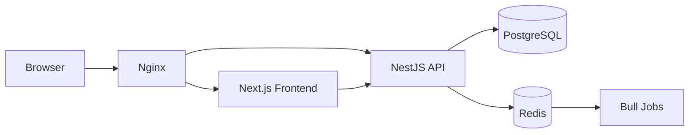

# Court Booking

Court Booking is a full-stack court reservation platform for public venue discovery, user bookings, and operational administration.

It is organized as a pnpm monorepo with a NestJS backend, a Next.js frontend, a shared types package, and Docker-based local infrastructure.

> Project note: this codebase was developed in a fast iteration style and is roughly 80-90% vibe-coded, then progressively tightened through manual review, testing, and production-oriented fixes.

## Overview

The platform supports:

- public court browsing and venue detail pages
- account registration, login, refresh, and logout
- time-slot based booking with payment confirmation and cancellation rules
- user booking history, booking status tracking, and notifications
- admin workflows for courts, sport types, features, slot templates, bookings, settings, customers, and revenue views
- Redis-backed jobs, caching, rate limiting, and temporary auth lockout
- SEO metadata, sitemap, robots, manifest, and social preview assets for public pages

## Feature Highlights

### Public Experience

- Home page with SEO metadata and brand assets
- Court discovery with filtering by search, sport type, district, and availability-related data
- Court detail pages with images, features, schedules, and booking entry points

### User Experience

- JWT cookie-based authentication
- Profile and avatar management
- Booking creation, payment confirmation, cancellation, and timeline tracking
- Notifications with unread counters and read state management

### Admin Experience

- Court CRUD with soft delete, restore, hard delete, feature assignment, image management, and slot editing
- Admin booking creation and booking operations such as cancel, refund, and check-in
- Reference catalog management for sport types and features
- Slot template management and court template application
- Runtime settings management
- Revenue, stats, and customer-related admin views

## Tech Stack

| Layer    | Stack                                                                   |
| -------- | ----------------------------------------------------------------------- |
| Frontend | Next.js 16, React 19, TypeScript, TanStack Query, Zustand, Tailwind CSS |
| Backend  | NestJS 11, TypeORM, PostgreSQL 17, Bull, Redis, Winston                 |
| Shared   | Workspace package for shared types, enums, and contracts                |
| Auth     | JWT access/refresh flow with httpOnly cookies                           |
| Infra    | Docker Compose, Nginx                                                   |
| Testing  | Jest, Supertest, Vitest                                                 |
| Tooling  | pnpm workspaces, ESLint, Prettier                                       |

## System Architecture



### Runtime Responsibilities

- **Frontend** renders public and protected UI, manages client-side auth state, and calls the backend API through Axios and TanStack Query.
- **Backend** owns authentication, booking rules, domain workflows, caching, and job processing.
- **PostgreSQL** stores transactional data and remains the source of truth for booking consistency.
- **Redis** is used for rate limiting, temporary lockout tracking, queues, and read-heavy caching. It is not used as the source of truth for booking availability.

## Monorepo Structure

```text
court-booking/
├── apps/
│   ├── backend/               NestJS API service
│   └── frontend/              Next.js 16 web application
├── packages/
│   └── shared/                Shared enums and types
├── infra/
│   ├── docker-compose.yml     Local multi-service stack
│   ├── docker-compose.prod.yml
│   └── nginx/
├── .env.example
├── .env.docker
├── .env.e2e
├── package.json
└── pnpm-workspace.yaml
```

## Installation and Run Guide

### Prerequisites

- Node.js 24+
- pnpm 9+
- Docker Desktop

For local non-Docker development:

- PostgreSQL 17+
- Redis 8+

### Quick Start with Docker

Recommended local flow:

```bash
docker compose -f infra/docker-compose.yml --env-file .env.docker down -v
docker compose -f infra/docker-compose.yml --env-file .env.docker up -d --build
```

Application URLs:

- App via Nginx: `http://localhost`
- Frontend direct: `http://localhost:3000`
- Backend API: `http://localhost:3001/api/v1`
- Swagger: `http://localhost:3001/api/docs`

### Seed Local Test Data

```bash
pnpm --filter @court-booking/backend db:seed
```

Important:

- the seed script is local-only
- it resets the schema with `dropSchema + synchronize`
- it does not run the migration chain

Seeded accounts:

- `admin@courtbooking.com` / `Admin@123`
- `user@courtbooking.com` / `User@123`
- `user2@courtbooking.com` / `User@123`
- `user3@courtbooking.com` / `User@123`

### Local Development Without Docker

1. Copy environment values:

```bash
cp .env.example .env
```

2. Install dependencies:

```bash
pnpm install
```

3. Start PostgreSQL and Redis

4. Run the backend migration:

```bash
pnpm --filter @court-booking/backend migration:run
```

5. Start both applications:

```bash
pnpm dev
```

Or run them separately:

```bash
pnpm dev:be
pnpm dev:fe
```

## Workspace Scripts

| Command        | Purpose                              |
| -------------- | ------------------------------------ |
| `pnpm dev`     | Run backend and frontend in parallel |
| `pnpm dev:be`  | Run backend only                     |
| `pnpm dev:fe`  | Run frontend only                    |
| `pnpm build`   | Build all workspaces                 |
| `pnpm test`    | Run workspace tests                  |
| `pnpm test:be` | Run backend unit tests               |
| `pnpm lint`    | Run lint tasks                       |
| `pnpm format`  | Run formatting tasks                 |

## Environment Variables

The repo uses three main environment files:

- `.env.example` for local development
- `.env.docker` for Docker Compose
- `.env.e2e` for backend e2e tests against Docker-published services

Core variables:

| Variable                                                  | Purpose                             |
| --------------------------------------------------------- | ----------------------------------- |
| `PORT`                                                    | Backend HTTP port                   |
| `FE_URL`                                                  | Frontend origin used for CORS       |
| `DB_HOST`, `DB_PORT`, `DB_NAME`, `DB_USER`, `DB_PASSWORD` | PostgreSQL connection               |
| `REDIS_HOST`, `REDIS_PORT`, `REDIS_PASSWORD`              | Redis connection                    |
| `JWT_SECRET`, `JWT_EXPIRES_IN`, `JWT_REFRESH_EXPIRES_IN`  | Authentication token configuration  |
| `NEXT_PUBLIC_SITE_URL`                                    | Public site origin for SEO metadata |
| `NEXT_PUBLIC_API_URL`                                     | Frontend API origin                 |
| `NEXTAUTH_URL`, `NEXTAUTH_SECRET`                         | Frontend auth-related configuration |

Detailed backend and frontend environment documentation is provided in their app-specific README files.

## API Endpoints

Swagger is available at:

- `http://localhost:3001/api/docs`

Main endpoint groups:

| Area           | Paths                                                |
| -------------- | ---------------------------------------------------- |
| Auth           | `/api/v1/auth/*`                                     |
| Users          | `/api/v1/users/*`                                    |
| Courts         | `/api/v1/courts/*`                                   |
| Bookings       | `/api/v1/bookings/*`                                 |
| Admin Bookings | `/api/v1/admin/bookings/*`                           |
| Notifications  | `/api/v1/notifications/*`                            |
| Features       | `/api/v1/features`, `/api/v1/admin/features/*`       |
| Sport Types    | `/api/v1/sport-types`, `/api/v1/admin/sport-types/*` |
| Slot Templates | `/api/v1/admin/slot-templates/*`                     |
| Settings       | `/api/v1/settings/runtime`, `/api/v1/admin/settings` |
| Health         | `/api/v1/health`                                     |

See the backend README for a fuller endpoint breakdown.

## Database Schema

Main entities:

| Entity                | Purpose                                          |
| --------------------- | ------------------------------------------------ |
| `users`               | End-user and admin accounts                      |
| `refresh_tokens`      | Refresh token persistence and revocation         |
| `courts`              | Venue metadata and booking eligibility           |
| `court_images`        | Court gallery images and display order           |
| `court_time_slots`    | Weekly slot definitions and prices               |
| `features`            | Reusable facility/service features               |
| `court_features`      | Many-to-many mapping between courts and features |
| `sport_types`         | Sport catalog and UI metadata                    |
| `bookings`            | Core reservation records and lifecycle fields    |
| `notifications`       | User notification feed                           |
| `slot_templates`      | Admin-defined weekly slot templates              |
| `slot_template_items` | Template slot rows                               |
| `system_settings`     | Runtime booking and analytics settings           |

The current consolidated migration is:

- [`apps/backend/src/database/migrations/1800000000000-InitialFullSchema.ts`](apps/backend/src/database/migrations/1800000000000-InitialFullSchema.ts)

## Notable Technical Design

### Booking Consistency

- Booking overlap control is handled in PostgreSQL transactions.
- The backend uses per-court advisory locks during booking creation.
- Redis is intentionally not used as the consistency layer for booking availability.

### Redis Strategy

Redis is used for:

- rate limiting
- Bull queue storage
- read-heavy cache for public/reference data
- auth failed-attempt counters and temporary lockout

The backend is designed to degrade gracefully when Redis is unavailable for non-critical auth tracking.

### Jobs and Reminders

Bull-based jobs handle:

- pending-payment expiry
- confirmed booking completion
- reminder notifications

### Public SEO

Public pages include:

- metadata and canonical URLs
- `robots.txt`
- `sitemap.xml`
- `manifest.webmanifest`
- venue-level metadata for court detail pages

## Testing

### Backend Unit Tests

```bash
pnpm --filter @court-booking/backend test
```

### Backend E2E Tests

```bash
docker compose -f infra/docker-compose.yml --env-file .env.docker up -d postgres redis
pnpm --filter @court-booking/backend test:e2e:concurrency
```

### Frontend Build Verification

```bash
pnpm --filter @court-booking/frontend build
```

## App-Specific Documentation

- Backend: [`apps/backend/README.md`](apps/backend/README.md)
- Frontend: [`apps/frontend/README.md`](apps/frontend/README.md)

## License

This repository is currently private unless you choose to publish it under a separate license.
